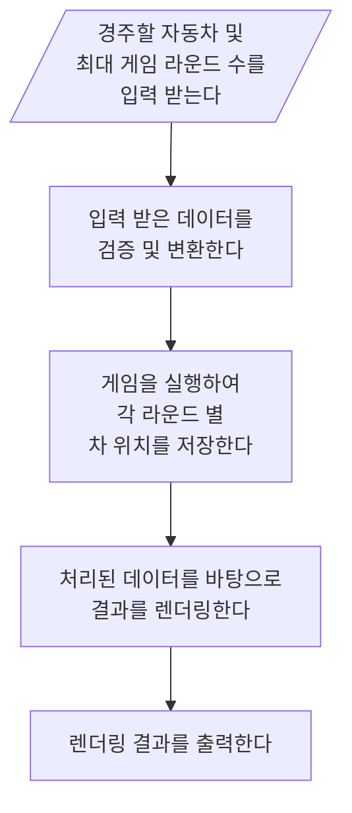

# 기능

### InputView

- 사용자 입력을 받아옴

```mermaid
flowchart
    A[/경주할 자동차 및\n최대 게임 라운드 수를\n입력 받는다/]
    B[입력 받은 데이터를\n검증 및 변환한다]
    C[게임을 실행하여\n각 라운드 별\n차 위치를 저장한다]
    D[처리된 데이터를 바탕으로\n결과를 렌더링한다]
    E[렌더링 결과를 출력한다]
    A-->B-->C-->D-->E
```